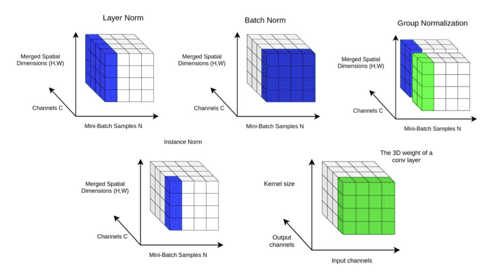

*ML Notes*

Documentation

1. [Frameworks](#frameworks)
2. [Normalization layers](#normalization-layers)

#### Frameworks:

* [PyTorch](https://pytorch.org/)
* [Numpy](https://numpy.org/)

#### Normalization layers:

* [Overview](https://theaisummer.com/normalization/)

